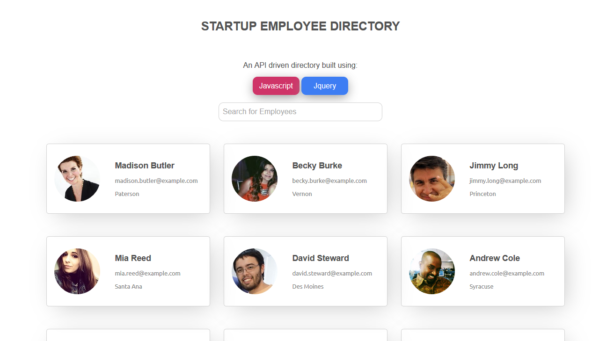
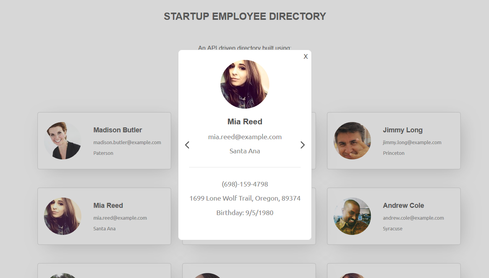
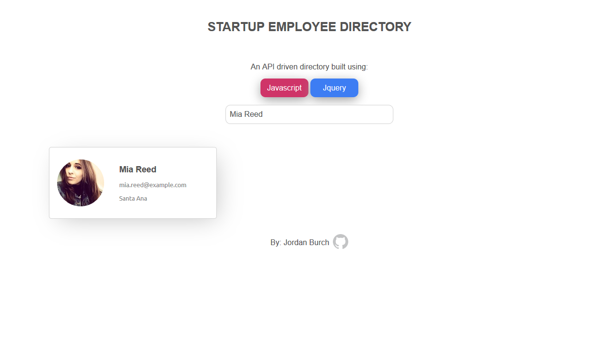

# Teachdegree-project 8
> A browser based Employee Directory using an API to fetch employee data throughtout the page dynamicly. ALso features a clickable modal which shows even more data. A seach box is also present to seach employees by Location, etc.

## Table of contents
* [General info](#general-info)
* [Screenshots](#screenshots)
* [Technologies](#technologies)
* [Features](#features)
* [Contact](#contact)

## General info
This project demonstrates my use of JavaScript to manipulate the DOM which API data. The data is fetched and then desected into easy to read cards which also turn into modals when clicked.\

You are able to cycle through modals which arrows and also filter out employees with the search box. All data provided randomly by https://randomuser.me/.

## Screenshots

## Technologies
* JavaScript
* CSS3
* HTML5

## Features
List of features ready and TODOs for future development
* Use of API to fetch remote Data
* working Modal which cycles through employees
* Seach box which can filter users by name, location, email, phone, etc

To-do list:
* Resign UI/UX to be more appealing

## Contact
Created by [@JordanBurch101](https://github.com/Jordanburch101) - feel free to contact me!